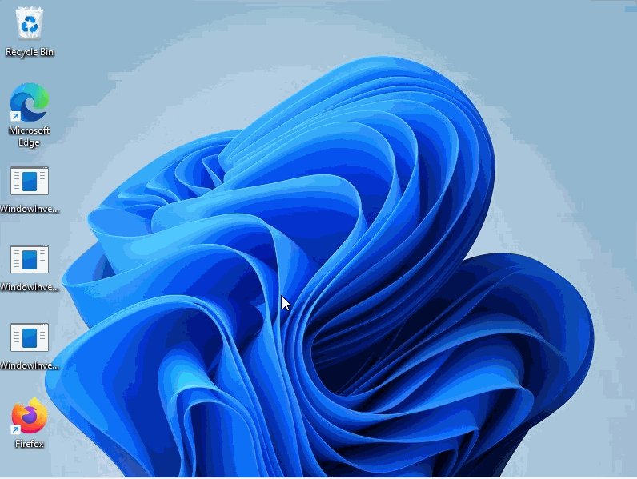
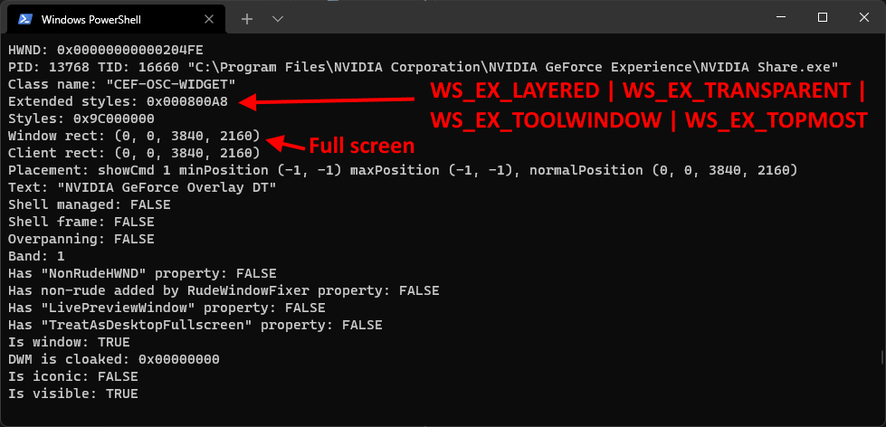
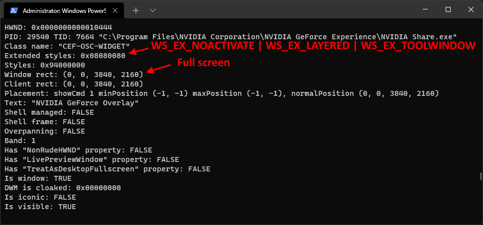
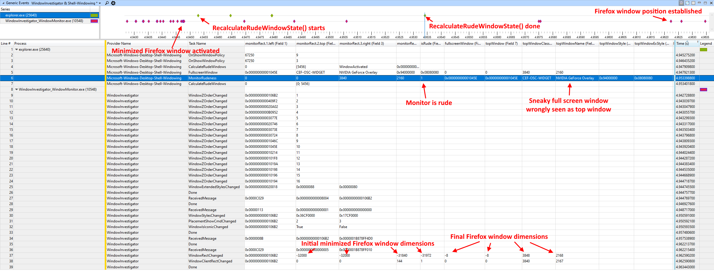

# RudeWindowFixer: fix Windows taskbar always-on-top issues
*Brought to you by [Etienne Dechamps][] - [GitHub][]*

**If you are looking for executables, see the [GitHub releases page][].**

## Description

Ever felt frustrated by this?

**RudeWindowFixer is a small program that gets rid of known "Windows taskbar not
always on top" bugs.**

Specifically, it works around proven bugs in the internal Windows taskbar code
where, under very specific circumstances, Windows mistakenly believes that you
are using a full screen application and hides the taskbar.

## Usage

1. Download `RudeWindowFixer.exe` from the [GitHub releases page][].
2. Run `RudeWindowFixer.exe`.
   - Nothing will happen at first; this is normal. RudeWindowFixer is quietly
     running in the background. You can check in the Task Manager if you want to
     make sure.
3. That's it!
   - You will likely want to make `RudeWindowFixer.exe` [run on startup][] so
     that it persists across reboots.
4. Upvote this [Microsoft bug report][] to hopefully get Microsoft to prioritize
   fixing the underlying Windows bug, which is described in detail below.

## Limitations

RudeWindowFixer does not claim to fix *all* possible taskbar always-on-top bugs.
Sadly, reverse engineering efforts (see below) revealed that the relevant
Windows code paths are somewhat brittle and might be prone to variations on
these problems (e.g. different triggers or problematic window state) that
RudeWindowFixer might not be able to detect and fix.

Also note that all investigation and testing was done on Windows 11 21H2
22000.434; other Windows versions might behave differently.

If you notice that RudeWindowFixer does not fix the problem for you, or at least
not consistently, do feel free to [file an issue][] - it might be possible to
[instrument your system](TRACING.md) to gather detailed data about your problem,
especially if you can reliably trigger it.

It's also theoretically possible that RudeWindowFixer could go overboard and
make the taskbar show up in cases where it shouldn't - namely, on top of full
screen applications (video players, games). This is unlikely to happen in
practice. If you've seen it happen, do [file an issue][] and make sure to
mention the name of the full screen application the taskbar is being shown on
top of.

## Specific known issues that RudeWindowFixer does NOT fix

- In [issue #3][issue3], it was discovered that Microsoft introduced a
  regression in Windows 11 build 22000.556 ([KB5011493][]). The bug is not
  present in build 22000.493. It appears that Microsoft has fixed it with the
  22H2 update, around build 22621.1105.
  - One known reproducer for this bug is:
    1. Open the Start Menu.
    2. Switch to any window using a taskbar window button.
    3. Click anywhere *at the exact moment* the taskbar finishes its hiding
       animation (assuming it's set to autohide).
       - The timing is somewhat tight so this might require a few attempts.
  - This is likely the issue that this [Feedback hub
    entry](https://aka.ms/AAg7dw5) is about.
  - This bug seems is completely unrelated to the other issues RudeWindowFixer
    is fixing (see below) - in fact it doesn't seem to involve the Rude Window
    Manager at all.
- RudeWindowFixer currently does not address the [problem][issue4] of an app
  being treated as full screen if its dimensions exceed those of the monitor,
  leading the taskbar to drop behind it.

## The problems in detail

_**Disclaimer:** The following information was gathered through careful
instrumentation of various window management facilities as well as [reverse
engineering][] (disassembly) of the relevant Windows code, helped by [public
Microsoft symbols][]. Reverse engineering is a difficult task where quick
progress requires a fair amount of guesswork, so I wouldn't assume all the
details below are exactly correct. This information applies to Windows 11 21H2
22000.434. The behaviour of other Windows versions might differ._

### TL;DR

There are two known scenarios in which the taskbar can accidentally lose its
"always on top" status. The following background information is required to
understand both:

- The taskbar "always on top" window property is controlled by a piece of
  internal Windows code called the *Rude Window Manager*.
- The Rude Window Manager will only make the taskbar "always on top" on a given
  monitor if, among the windows located on that monitor, the top (foreground)
  window is not a full screen window.
- Some applications create *transparent* full screen windows that are
  essentially invisible, but still count as full screen windows as far as the
  Rude Window Manager is concerned.

The first failure mode is fairly simple: it is triggered by the presence of an
*always on top* transparent full screen window. This essentially confuses the
Rude Window Manager, resulting in the taskbar "always on top" property being
dropped.

The second failure mode is more subtle and harder to trigger, but does not
require the transparent full screen window to be always on top:

- A minimized window is not "located on" any monitor and is therefore never seen
  as the "top" window by the Rude Window Manager.
- When a minimized window is activated, a race condition can occur wherein the
  Rude Window Manager still sees the window as minimized and therefore does not
  treat it as the new "top" window.
- If the next window located on that monitor happens to be a (possibly
  transparent) full screen window, the Rude Window Manager will wrongly conclude
  that a full screen window is on top, and wrongly drop the taskbar "always on
  top" property.

The rest of this section go into each of these points in more detail.

### Taskbar "always on top" behavior

During normal usage, the Windows taskbar is "always on top" of other windows.
More specifically, the taskbar window (`Shell_TrayWnd` window class, part of
`explorer.exe`) has the `WS_EX_TOPMOST` [extended window style][].

However, there is a case where Windows will drop the "always on top" property
and will put the taskbar behind all other windows. This happens when Windows
believes the user is interacting with a full screen application. This prevents
the taskbar from obscuring the full screen application.

### The Rude Window Manager

In internal Windows code, this full screen detection logic is implemented in an
internal class called the *rude window manager*
(`twinui!CGlobalRudeWindowManager`, also running in `explorer.exe`). Internally,
the code uses the term *rude monitor* to refer to a monitor on which the top
window is a full screen window. RudeWindowFixer is named after this terminology.

(If you are lucky enough to have access to the Windows source, you will find
this code in `shell\twinui\rudewindowmanager\lib\globalrudewindowmanager.cpp`.)

Roughly, the rude window manager is implemented as follows:

1. Listen for specific window management events. Most of these events come from
   [shell hook messages][], which are generated by the kernel (`win32k`). For
   the purpose of this discussion, we are mostly interested in:
     - Windows entering or exiting full screen status. These are codified
       using undocumented `wParam` values `0x35` and `0x36`, respectively.
       These appear to be generated based on window dimension changes.
     - Window activation events (`HSHELL_WINDOWACTIVATED` and
       `HSHELL_RUDEAPPACTIVATED` messages - note the differences between the two
       aren't clear, and the rude window manager treats them the same).
2. If one of these events occur,
   `twinui!CGlobalRudeWindowManager::RecalculateRudeWindowState()` will look at
   each monitor and determine if it should be considered "rude".
3. In the event a monitor "rudeness" changes, notifications are delivered to
   other components through `CRudeWindowManager`.
   - This notably includes the code in charge of the taskbar, through
     `Explorer!CTray::OnRudeWindowStateChange()`, which calls
     `Taskbar!TrayUI::RudenessChanged()`, which calls
     `Taskbar!TrayUI::_ResetZorder()`, which finally sets or unsets the "always
     on top" property of the taskbar window based on the new state.

Let's focus on step (2).

### What makes a monitor "rude"?

`RecalculateRudeWindowState()` looks at the properties of visible windows to
make this determination. For the purpose of this discussion, the most relevant
property is the window dimensions (i.e. its spatial coordinates and size).
These are determined by
`RudeWindowWin32Functions::GetWindowRectForFullscreenCheck()` which internally
uses [`GetWindowRect()`][].

(If the window has any of the `WS_THICKFRAME` or `WS_CAPTION` [style
bits][window style], i.e. it has a border, then [`GetClientRect()`][] is used
instead and the result is converted to screen coordinates using
[`MapWindowPoints()`]. This subtlety doesn't matter much for the purposes of
this discussion.)

A window is deemed to be located *on* a monitor if its dimensions overlap with
that monitor.

Within the set of windows that are on a given monitor, the window that comes at
the top of the [Z-order][] is defined as the *top* (foreground) window for that
monitor.

The Rude Window Manager internally keeps track of a set of full screen windows.
A window is added to that set upon receipt of a "full screen enter" (`0x35`)
shell hook message. It is removed from the set upon receipt of a "full screen
exit" (`0x36`) shell hook message.

If the top window on a given monitor is found in the set of full screen windows,
then the monitor is considered *rude*.

### Transparent full screen windows

Now, at this point, if you are not using any full screen applications (games,
video players), you might wonder how this pertains to your case in any way.

Here's how: you might actually be staring at a full screen window right now. You
just can't *see* it!

Indeed, it is possible for applications to set up windows that are:

- *Transparent*, using the [layered window][] mechanism (`WS_EX_LAYERED`
  [extended window style][]), combined with transparency effects such as
  `WS_EX_TRANSPARENT` or [`SetLayeredWindowAttributes()`][].
- *Click-through*, using the same layered window mechanism. This prevents the
  window from capturing user input, which instead passes through to the window
  below it.
- *Not listed* in window lists such as the taskbar or ALT+TAB, again using
  specific styles.

If a full screen window does all of the above, then it *de facto* becomes
essentially invisible to the user; it's as if the window isn't there. This
basically means you can have full screen windows on your monitor without
realizing it.

Consider this: these sneaky full screen windows might be invisible to the user,
but *they are definitely visible to the Rude Window Manager!* More specifically,
the window will still be added to the Rude Window Manager's set of full screen
windows.

Now, if that transparent full screen window happens to also be "always on top"
(i.e. it has the `WS_EX_TOPMOST` extended window style), then it's game over
already: the Rude Window Manager will always see that window as the top window,
and since it's in its full screen window set, the monitor will be considered
rude. As a result, the taskbar loses its always on top status for as long as the
situation persists.

You can spot these transparent full screen windows using specialized tools such
as [GuiPropView][] or [WindowInvestigator][] WindowMonitor. A notable example
comes from the [GeForce Experience][] overlay, which displays such a window when
displaying information on some part of the screen; e.g. a corner notification,
or performance statistics. [WindowInvestigator][] also provides a
TransparentFullscreenWindow tool that simulates a transparent full screen
window.

This is one relatively simple scenario where the taskbar always on top state can
be messed up. However, problems can still occur even if the transparent full
screen window is *not* always on top, and is not even the current top window.
Clearly, there's at least one other failure mode we're still missing. This is
where things get more complicated.

### Asking for trouble: rudeness state desynchronization

One fundamental problem with the way `CGlobalRudeWindowManager` works is that
it looks at a wide set of window properties, *but it is not necessarily notified
when some of these properties change*. Indeed the rude window manager only
listens to a fairly narrow set of events (mostly window activation events). This
can lead to the monitor rudeness state getting out of sync, as it might not be
recomputed in response to changes to window properties.

If this happens, *the taskbar might wrongly behave as if a full screen window is
on top and drop itself to the background (or vice-versa), even though that is
not the case*.

In theory, the missed event could be a change to any kind of property the rude
window manager could be interested in. RudeWindowFixer focuses on one especially
problematic scenario that we're going to discuss next.

### Missed changes to window dimensions

Consider the following sequence of events:

1. A window is activated and thus comes to the top (foreground).
2. `CGlobalRudeWindowManager` runs and calculate the new rudeness state.
3. The dimensions of the window that was just activated change.

A change to window dimensions is not an event `CGlobalRudeWindowManager` reacts
to. (It will be notified if the window is becoming full screen - but as we'll
see, that won't help with this particular bug.) This can lead to rudeness state
getting out of sync.

### A race condition: activating a minimized window

The animated screencap shown at the top of this document shows the bug being
triggered by [activating][] a minimized Firefox window. As it turns out, there
is a very specific (and quite subtle!) reason why opening a minimized window
can trigger a rudeness state desync.

When a minimized window is activated (e.g. by clicking on it in the taskbar, as
shown in the screencap), the following occurs immediately (among other things):

- The minimized (`WS_ICONIC`) [window style][] is removed.
- The window is moved to the foreground, i.e. the top of the [Z-order][].
- `HSHELL_WINDOWACTIVATED`/`HSHELL_RUDEAPPACTIVATED` notifications are delivered
  to [registered listeners][shell hook messages], including the Rude Window
  Manager.
- A [`WM_WINDOWPOSCHANGING`][] message is sent to the window.

Now here's the important part: *the window dimensions are only updated after the
window has processed the `WM_WINDOWPOSCHANGING` message*. This is because the
window can [make changes][] to the suggested dimensions while processing this
message, so the final dimensions are not known until the message has been
completely handled by the application.

The amount of time it takes for the change in window dimensions to take place
is therefore up to the application. It is potentially unbounded, varies
depending on the application, and is not necessarily deterministic. This
explains why the problem is not always reproducible and seems to occur more or
less often depending on the application. Firefox seems especially prone to this
problem, for example. At the other extreme, you'll have a hard time triggering
it with something like Notepad. For demonstration purposes, DelayedWindowPos
from the [WindowInvestigator][] toolbox can be used to simulate a window with
arbitrary `WM_WINDOWPOSCHANGING` processing delays.

So how does this relate to the Rude Window Manager? Well, in this context,
`RecalculateRudeWindowState()` is called on receipt of the
`HSHELL_WINDOWACTIVATED` or `HSHELL_RUDEAPPACTIVATED` message, which is sent
around the same time as `WM_WINDOWPOSCHANGING`. This means that the new rudeness
state is calculated *at the same time* the new top window is processing the
`WM_WINDOWPOSCHANGING` message. These two processes will therefore [race][]
against each other. If the window was quick enough to process the
`WM_WINDOWPOSCHANGING` message in time, the Rude Window Manager will use the
final dimensions and compute the correct state. Conversely, if the window is too
slow to process the message, *the Rude Window Manager will operate based on
stale window dimensions, and potentially compute an incorrect state*.

Unfortunately, the Rude Window Manager is not notified again when window
dimensions finally change (unless it is becoming full screen, but let's assume
that's not the case here). Therefore, that incorrect state will persist until
the next event occurs - typically, when activating another window.

### Dimensions of minimized windows

We still need to discuss is why this is a problem for *initially minimized*
windows specifically. This is because, for [historical reasons][], Windows moves
windows to an arbitrary (-32000, -32000) position when they are minimized. This
position is what `RecalculateRudeWindowState()` will see if it "wins" the race
and retrieves the window position before the application had a chance to process
the `WM_WINDOWPOSCHANGING` message.

This is important, because a window that is at coordinates (-32000, -32000)
*does not overlap with any monitor*. Therefore, the Rude Window Manager will not
consider that window to be the top (foreground) window on any monitor. As far as
the Rude Window Manager is concerned, it's as if that window does not exist at
all.

In contrast, if the window is not initially minimized, then it already has
proper dimensions, and the Rude Window Manager will correctly determine which
monitor it's on, no matter who "wins" the race condition. This is why this bug
typically only surfaces when activating an *initially minimized* window.

### Full screen windows and minimized windows

As we just discussed, when the bug is triggered, the Rude Window Manager's
assessment of which window is the top window is incorrect. Instead of treating
the window that was just activated as the top window, the Rude Window Manager
will wrongly believe the next window in the Z-order is the top window.

If that incorrect top window is not a full screen window, then this is not a
real problem in practice: the monitor was not rude before, and it's still not
rude now. The taskbar therefore keeps its "always on top" property, and
everything is still fine.

We can therefore deduce that this bug only surfaces when activating a minimized
window *and the next window in the Z-order is a full screen window*. In other
words, when switching *directly* from a full screen window to an initially
minimized window.

### Switching from a transparent full screen window

Now, you might object that you're not actually using any full screen
applications. Even if you are, it's actually pretty hard to switch *directly*
from a full screen window to a minimized window. You could do it from the
taskbar, but then you'd need to *activate* the taskbar first, since it's not
shown on top of full screen applications - but then you're not switching
directly from the full screen window anymore. You could also do it using
ALT+TAB, but that's also indirect since you're going through the ALT+TAB window
itself. (The ALT+TAB window is a bit special - it is a full screen window, but
it's not treated as such by the Rude Window Manager, because it has a magic
`"NonRudeHWND"` [window property][] that the Rude Window Manager recognizes.)

However, these objections imply *real* full screen applications. Remember the
*transparent* full screen windows that we mentioned previously? If the top
window happens to be a transparent full screen window, then you might, in fact,
unknowingly switch directly *from* that window to a minimized window by clicking
its icon on the taskbar!

Because transparent full screen windows usually cannot be activated directly by
the user, they will naturally tend to fall to the bottom of the window Z-order
(unless they are "always on top" of course, but we've already discussed the case
of always on top transparent full screen windows). The Rude Window Manager will
typically not see them as top (foreground) windows. There is one notable
exception, though: if all windows are minimized, i.e. the user is looking at the
desktop, then a transparent fullscreen window will become the top window, *and
the Rude Window Monitor will wrongly conclude the monitor is rude*. At this
point *the taskbar has already lost its "always on top" state*, but that is not
yet apparent to the user because there is no opaque window sitting atop the
taskbar.

A notable example of a non-always-on-top transparent full screen window that
can cause this problem is one of the windows created by the [GeForce
Experience][] overlay. Yes, GeForce Experience again - but note this is not the
same window as the one we previously discussed. This one is not "always on top";
however, it *always exists* as long as the overlay feature is enabled, even when
it's not being used.

If the current top window is such a transparent full screen window, and the user
activates a minimized window by clicking on its icon in the taskbar, then the
race we described previously will take place, the Rude Window Manager can miss
the new top window, and fail to switch the monitor to the non-rude state.

### Putting it all together

We now have all the information we need to reconstruct the sequence of events
that trigger the second failure mode we are interested in, in addition to the
simpler "always-on-top transparent full screen window" failure mode:

1. All windows are minimized and the user is looking at the desktop.
2. Unbeknownst to the user, they are also looking at a transparent clickthrough
   full screen window, such as the GeForce experience overlay window.
3. The last run of `CGlobalRudeWindowManager::RecalculateRudeWindowState()`
   concluded that the transparent full screen window is on top, and the monitor
   is therefore rude. The taskbar does not have the "always on top" property,
   but the user is unlikely to notice since they don't have any windows open.
4. The user activates a minimized window by clicking its taskbar icon.
5. `CGlobalRudeWindowManager::RecalculateRudeWindowState()` runs. Unfortunately,
   the activated window dimensions have not been updated yet. The window is
   still located at the "dummy" minimized position (-32000, -32000), which is
   not on the monitor; therefore, `RecalculateRudeWindowState()` ignores that
   window, and the computed state ends up the same as (3). The monitor is still
   rude and the taskbar is not "always on top".
6. The newly activated window finishes processing `WM_WINDOWPOSCHANGING` and
   the window dimensions are established on the monitor - but at this point it's
   too late.
7. Because the Rude Window Manager has already run, and is not triggered by a
   change in window dimensions, the "always on top" property is not reinstated
   on the taskbar, which ends up falling behind the newly activated window.

## How RudeWindowFixer works

RudeWindowFixer listens to the same [shell hook messages][] as the Rude Window
Manager. When an event is received, RudeWindowFixer sets a timer for a fixed
amount of time (currently 50 milliseconds). When the timer elapses,
RudeWindowFixer does two things:

1. It goes through every [visible][] window, looking for transparent windows.
   - Currently, a window is considered transparent if it has the `WS_EX_LAYERED`
     as well as `WS_EX_TRANSPARENT` or `WS_EX_NOACTIVATE` [extended window
     styles][extended window style].
   - If a transparent window is found, RudeWindowFixer will ensure it is *not*
     included in the Rude Windows Manager's set of full screen windows.
     - It does this by adding a "magic" undocumented [window property][]
       (`"NonRudeHWND"`) that the Rude Window Manager is known to look for.
     - It also sends a "full screen exit" message to the Rude Window Manager
       just in case the window was already in the set.
2. It forces the Rude Window Manager to recalculate rudeness state again by
   sending it a dummy message.

The above approach tackles the problem from two angles at the same time:
RudeWindowFixer tries to ensure transparent windows are never treated as full
screen windows, while attempting to mitigate `WM_WINDOWPOSCHANGING` race
conditions by "poking" the Rude Window Manager again after some amount of time
has elapsed.

The 50 ms timer interval should be more than enough time for the activated
window to finish processing the `WM_WINDOWPOSCHANGING` message. (For example,
Firefox takes less than ~20 ms.) Therefore, by the time the Rude Window Manager
is forced to run a second time, the window should have settled unto its final
position, and the Rude Window Manager should therefore be able to determine the
correct top window.

Obviously the fixed delay is somewhat arbitrary, and it is entirely possible for
a window to take more than 50 milliseconds to settle. A more robust solution
would trigger the Rude Window Manager as soon as the `WM_WINDOWPOSCHANGING`
message has been processed, regardless of how long that takes. This might be
technically feasible using [hooks][], but such an approach would be complicated
and would present higher potential for harmful side effects.

The delayed operation is also useful when dealing with windows that are *not*
created as transparent, but become transparent shortly afterwards. This is the
case for the GeForce Experience "DT" window, for example.

In theory, RudeWindowFixer can mitigate any issue where the Rude Window Manager
is wrongly treating a transparent window as full screen, and/or races against
a shell hook event, including issues that do not necessarily follow the precise
sequence of events described above. Therefore, RudeWindowFixer could help even
if your situation does not exactly match the one RudeWindowFixer was designed to
address. However, RudeWindowFixer is unlikely to help with Rude Window Manager
bugs that do not involve transparent windows (as defined above) nor shell hook
message race conditions.

## Tracing

RudeWindowFixer logs every event through an [Event Tracing for Windows (ETW)][]
provider. This can be used to troubleshoot RudeWindowFixer operation.

The provider GUID is `F7A4605A-5EBA-46A2-8A75-D7E2FECC8D62`. You can enter that
GUID directly in [TraceView][] for real time logging, or you can load the
included [`RudeWindowFixer.wprp`][] [recording profile][] into the [Windows
Performance Recorder (WPR)][] for a more thorough analysis. The Provider Name
will appear as `RudeWindowFixer`.

## See also

- This [SuperUser question][superuser1] and [this one][superuser2] discuss
  taskbar always on top issues.
- This [bug report][eclipse] is the first known public report of what looks like
  similar issues, going all the way back to 2002!
- The [WindowInvestigator][] toolbox provides useful tools if you want to
  investigate similar issues yourself.

## Developer information

RudeWindowFixer is designed to be built using CMake within the Microsoft Visual
C++ 2019 toolchain native CMake support.

There are no dependencies besides the Windows SDK.

[activating]: https://docs.microsoft.com/en-us/windows/win32/winmsg/window-features#active-window
[bug report]: https://bugs.eclipse.org/bugs/show_bug.cgi?id=24052
[eclipse]: https://bugs.eclipse.org/bugs/show_bug.cgi?id=24052
[Etienne Dechamps]: mailto:etienne@edechamps.fr
[extended window style]: https://docs.microsoft.com/en-us/windows/win32/winmsg/extended-window-styles
[Event Tracing for Windows (ETW)]: https://docs.microsoft.com/en-us/windows/win32/etw/about-event-tracing
[file an issue]: https://github.com/dechamps/RudeWindowFixer/issues
[`GetClientRect()`]: https://docs.microsoft.com/en-us/windows/win32/api/winuser/nf-winuser-getclientrect
[`GetWindowRect()`]: https://docs.microsoft.com/en-us/windows/win32/api/winuser/nf-winuser-getwindowrect
[GuiPropView]: https://www.nirsoft.net/utils/gui_prop_view.html
[historical reasons]: https://devblogs.microsoft.com/oldnewthing/?p=37453
[GeForce Experience]: https://www.nvidia.com/en-gb/geforce/geforce-experience/
[GitHub]: https://github.com/dechamps/RudeWindowFixer
[GitHub releases page]: https://github.com/dechamps/RudeWindowFixer/releases
[hooks]: https://docs.microsoft.com/en-us/windows/win32/winmsg/hooks
[issue2]: https://github.com/dechamps/RudeWindowFixer/issues/2
[issue3]: https://github.com/dechamps/RudeWindowFixer/issues/3
[issue4]: https://github.com/dechamps/RudeWindowFixer/issues/4
[make changes]: https://devblogs.microsoft.com/oldnewthing/20080116-00/?p=23803
[KB5011493]: https://support.microsoft.com/en-gb/topic/march-8-2022-kb5011493-os-build-22000-556-8f77cda3-9d4b-4b85-b6a4-34d5e3c98434
[`MapWindowPoints()`]: https://docs.microsoft.com/en-us/windows/win32/api/winuser/nf-winuser-mapwindowpoints
[Microsoft bug report]: https://aka.ms/AAfmyzk
[layered window]: https://docs.microsoft.com/en-us/windows/win32/winmsg/window-features#layered-windows
[WindowInvestigator]: https://github.com/dechamps/WindowInvestigator
[public Microsoft symbols]: https://docs.microsoft.com/en-us/windows-hardware/drivers/debugger/microsoft-public-symbols
[race]: https://en.wikipedia.org/wiki/Race_condition
[recording profile]: https://docs.microsoft.com/en-us/windows-hardware/test/wpt/authoring-recording-profiles
[reverse engineering]: https://en.wikipedia.org/wiki/Reverse_engineering#Binary_software
[TraceView]: https://docs.microsoft.com/en-us/windows-hardware/drivers/devtest/traceview
[`RudeWindowFixer.wprp`]: RudeWindowFixer.wprp
[`SetLayeredWindowAttributes()`]: https://docs.microsoft.com/en-us/windows/win32/api/winuser/nf-winuser-setlayeredwindowattributes
[shell hook messages]: https://docs.microsoft.com/en-us/windows/win32/api/winuser/nf-winuser-registershellhookwindow
[superuser1]: https://superuser.com/questions/1163969/windows-10-taskbar-is-not-always-on-top
[superuser2]: https://superuser.com/questions/483453/windows-7-task-bar-stuck-in-hiding-how-to-fix
[visible]: https://docs.microsoft.com/en-us/windows/win32/api/winuser/nf-winuser-iswindowvisible
[window style]: https://docs.microsoft.com/en-us/windows/win32/winmsg/window-styles
[window property]: https://docs.microsoft.com/en-us/windows/win32/winmsg/window-properties
[run on startup]: https://www.howtogeek.com/228467/how-to-make-a-program-run-at-startup-on-any-computer/
[Z-order]: https://docs.microsoft.com/en-us/windows/win32/winmsg/window-features#z-order
[Windows Performance Recorder (WPR)]: https://docs.microsoft.com/en-us/windows-hardware/test/wpt/windows-performance-recorder
[`WM_WINDOWPOSCHANGING`]: https://docs.microsoft.com/en-us/windows/win32/winmsg/wm-windowposchanging
[WindowInvestigator]: https://github.com/dechamps/WindowInvestigator
