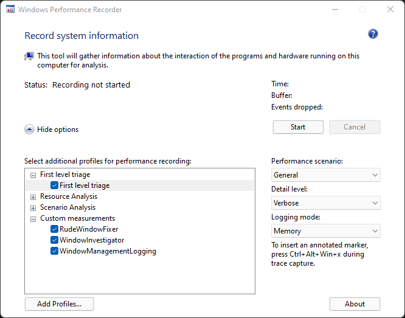
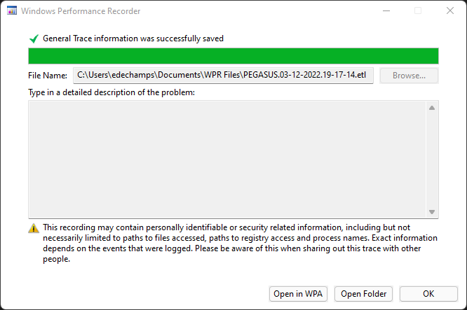

# Rude Window Manager tracing

Rude Window Manager issues can be extremely subtle and difficult to reproduce.
To help investigate these issues, it is often useful to instrument the system
and [record][] detailed [traces][].

The idea behind tracing is to record every event - including window management
events - that is occurring on the machine in an extreme level of detail, and
gather it all into a single trace file that can be [analysed][] later, not
necessarily on the same machine, and not necessarily by the same person.
The trace file will hopefully provide enough information to determine the root
cause of the issue.

## How to gather a trace

1. Using the Task Manager or equivalent, terminate any running
   RudeWindowFixer process.

2. Download the latest [release][WindowInvestigatorReleases] of
  [WindowInvestigator][]. Extract it and get ready to run
  `WindowInvestigator_WindowMonitor.exe`. Do not run it yet.

3. Make sure you have the latest [release][RudeWindowFixerReleases] of
   RudeWindowFixer. Be prepared to start it, but do not do it yet.

5. Open the [Windows Performance Recorder][record]: hit Win+R (Run) and enter
   `wprui`.

6. If not done previously, add the following 3 profiles (use "Save As..." to
   download them):
   - [RudeWindowFixer profile][]
   - [WindowInvestigator profile][]
   - [WindowManagementLogging profile][]

7. Make sure the only selected profiles are "First level triage" and the 3
   aforementioned profiles.

8. On the right hand side, make sure "Performance Scenario" is set to "General",
   "Detail Level" is set to "Verbose" and "Logging mode" is set to "Memory".

9. At this point the WPR window should look like this:

   

10. Close as many windows as you can (aside from the windows used in this
   procedure of course) and in general try to make your system as "idle" as
   possible.

11. Hit "Start" and wait for the "Time:" to start counting.

12. Immediately start WindowMonitor (preferably as Administrator) and keep it
    running.

13. Immediately after WindowMonitor has started, start RudeWindowFixer.

14. Try to reproduce the problem as quickly as you can.
    - The reason why speed is important is because traces get *very* large,
      *very* quickly - they grow at a rate of about 10 MB/s, so you can easily
      end up with a multi-gigabyte trace after just a few minutes. This makes
      traces harder to share and analyse.
    - If you can't reproduce the problem on demand, then you'll have no choice
      but to keep tracing until it occurs. Thankfully, the trace will "wrap
      around" after it hits a certain size limit, at which point new events
      overwrite old ones. The trace size stays constant after that point. Your
      computer might run slightly slower while tracing is taking place.

15. As soon as you notice the problem occurring, *immediately* hit
    Ctrl+Alt+Win+X, then immediately hit Enter - do not waste time entering a
    label.
    - This will add a marker event to help figure out when the issue occurred
      while analysing the trace. Investigation will be made easier if the marker
      is as close as possible to the time the problem occurs.

16. In the Windows Performance Recorder, click "Save", then "Save" again. Wait
    for the save operation to complete. Meanwhile, you can close WindowMonitor.
    - Note that saving the trace can take some time and typically stays at 100%
      for a while. The save is only complete when you see the following screen:

      

17. Click "Open Folder".

18. Using any compression tool (e.g. 7-Zip), compress the resulting `.etl` file
    and associated `.etl.NGENPDB` folder. 
    - Trace files are very large, but thankfully they are extremely
      compressible; a ~20x compression ratio is typical.

19. Send the resulting archive to the person in charge of analysis. You might
    want to use a file sharing service.
    - **Be aware that traces capture almost everything that's going on in your
      entire system, including potentially private information such as file
      paths and window titles. Do NOT share the trace publicly (e.g. do NOT
      attach it to a GitHub comment) - only share it with someone you trust.**
    - Along with the trace, it's a good idea to describe what you were doing
      when the problem occurred, in as much detail as possible.

[analysed]: https://docs.microsoft.com/en-us/windows-hardware/test/wpt/windows-performance-analyzer
[record]: https://docs.microsoft.com/en-us/windows-hardware/test/wpt/windows-performance-recorder
[RudeWindowFixer profile]: https://raw.githubusercontent.com/dechamps/RudeWindowFixer/master/RudeWindowFixer.wprp
[RudeWindowFixerReleases]: https://github.com/dechamps/RudeWindowFixer/releases
[WindowInvestigator profile]: https://raw.githubusercontent.com/dechamps/WindowInvestigator/master/WindowInvestigator.wprp
[WindowManagementLogging profile]: https://raw.githubusercontent.com/dechamps/WindowInvestigator/master/WindowManagementLogging.wprp
[traces]: https://docs.microsoft.com/en-us/windows/win32/etw/about-event-tracing
[WindowInvestigator]: https://github.com/dechamps/WindowInvestigator
[WindowInvestigatorReleases]: https://github.com/dechamps/WindowInvestigator/releases
